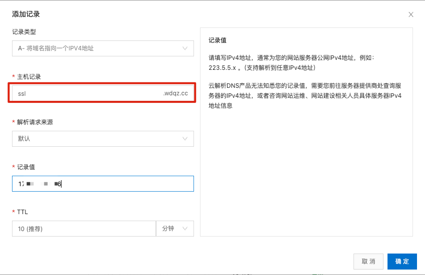

# QzSSL证书自动化续签客户端

# 项目说明
> 本系统为针对 <a href="https://qzssl.com" target="_blank">QzSSL.com</a> 证书平台开发的自动续签客户端。  
> 凡是从 QzSSL.com 购买了证书，且希望能摆脱一年手动续签一次的用户，可以下载此工具。  
> 目前本系统只适配了 Linux 系统 + Nginx 服务器

# 系统功能逻辑说明
1、QzSSl.com 购买证书  
2、在你服务器安装此客户端  
3、配置AppID+秘钥（配置好后自动同步 QzSSL.com 上购买的证书）  
4、设置域名验证文件+证书目录，并开启自动续签  
5、结束，后续可以不用惦记证书过期了  

# 适用用户
在 QzSSL.com 有大量证书的客户，可极大降低维护成本，降低运维成本

# 安装步骤
1、拉取代码：`git pull git@github.com:woodheader/qzssl-client.git`  
2、进入项目：`cd qzssl-client`  
3、设置执行权限：`chmod +x run_linux.sh`  
4、进入bin目录：`cd bin/linux/`  
5、解压node执行文件：`unzip bin.zip`  
6、返回根目录：`cd ../../`  
7、运行服务：`./run_linux.sh &`  
如果你的服务器自己安装了 node，也可以直接运行：`cd .src/ && node resign_server.js &`  

# 注意事项
系统运行后，默认占用：`18899` 端口，若不想外网直接 `ip+端口` 访问，可使用独立二级域名  
二级域名访问，建议监听80端口，也就是通过 `http` 协议访问  
有动手能力的，可自行修改 `WebSocket` 部分代码，添加你自己的证书，以支持 `https` 和 `wss`

先添加二级域名解析：  
登录阿里云 -> 云解析DNS -> 添加记录，保存即可  


然后在你服务器上增加二级域名 `nginx` 配置：
```
server {
    	listen 80;
    	# 填写你自己的二级域名
    	server_name  ssl.wdqz.cc;
        location / {
            proxy_pass http://localhost:18899/;
            proxy_http_version 1.1;
            proxy_set_header Upgrade $http_upgrade;
            proxy_set_header Connection "upgrade";
            proxy_set_header Host $host;
    
            # 可选：设置超时时间以避免连接过早关闭
            proxy_read_timeout 86400s;
            proxy_send_timeout 86400s;
        }
}

# 将以上 nginx 配置放入 ssl.wdqz.cc.conf（修改为你自己的域名.conf） 文件中
# 最后 nginx -s reload 即可
```

# 系统界面


# 开源协议
请遵循 GPL3.0 协议，如需商用，请访问 <a href="https://qzssl.com" target="_blank">QzSSL.com</a> 联系商务人员授权！ 
